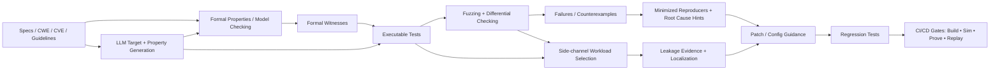
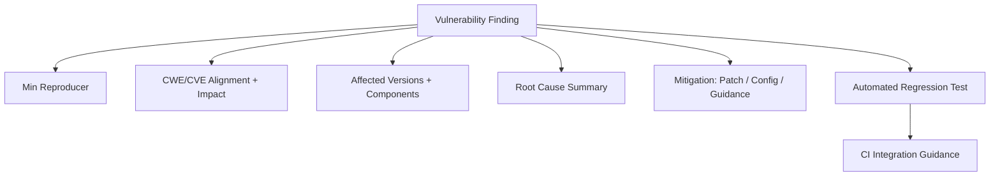

# [RISCue-V] Open RISC‑V Security Assurance (POSES Track 3)

Building a **comprehensive, reusable, and continuously improving security assurance framework** for the **open RISC‑V hardware–software ecosystem**.

  

We develop and integrate complementary techniques across the stack
- RTL 
- SoCs 
- Firmware 
- OS/runtime
- TEEs 
- Toolchains 
- Applications

to systematically discover, validate, localize, mitigate, and prevent the reintroduction of vulnerabilities.

---

## Why this organization exists

Open RISC‑V accelerates innovation through modular reuse, but reuse also creates ecosystem-scale security risk:

- Vulnerabilities can originate in *individual components* (core RTL, accelerators, firmware, enclave runtimes).
- Vulnerabilities can emerge at *interfaces* between independently developed layers.
- Bugs and security weaknesses can **propagate across cores and generations** via shared RTL and patterns.
- Many adopters (startups, small vendors, integrators) lack large internal security verification teams.

Our goal is to make **security evidence reusable** across implementations and releases—turning one discovery into durable ecosystem protection.

---

## What we build (four thrusts)

### Coverage-Guided Fuzzing 
Continuous fuzzing of RISC‑V cores and HW/SW interfaces with a **shared cross-implementation corpus** of:
- minimized reproducers
- high-value coverage tests
- regressions + configurations
- artifacts derived from formal/LLM/side-channel flows

### Scalable Formal Verification
Formal guarantees for security-critical properties using:
- model checking of security properties (including those derived from natural-language specs/guidelines)
- symbolic analysis of firmware and HW/FW co-simulation
- scenario-based equivalence checking (HIVE-style decomposition + hints)

### LLM-Guided Microarchitectural Vulnerability Analysis
LLMs connect specs/RTL/coverage gaps to:
- candidate security assertions and cover properties
- adversarial RISC‑V programs / module-level traces
- witness-to-test conversion (formal → executable tests)

### Side-Channel Leakage Assessment (Pre-silicon)
CI/CD-ready workflows to detect and regress-test **timing/power/contension leakage** in:
- crypto ISEs and accelerators
- privilege boundary handling (interrupts/context switching)
- enclave entry/exit and runtime paths
- compositional leakage across core + firmware + OS + runtime + compiler choices

---

## How the methods reinforce each other

### Artifact flow overview (security evidence as the interface)

### “Security package” output (what we upstream/share)

Each confirmed issue produces a reusable package:

---

## Repositories

> Draft version for the planned structure

- **`org-meta/`** — Governance, contribution policy, disclosure policy, code of conduct
- **`assurance-infra/`** — Shared build/test harnesses, CI pipelines, artifact schemas
- **`security-test-corpus/`** — Cross-core corpus: tests, minimized reproducers, configurations, metadata
- **`fuzzing/`** — Reuse-aware fuzzing orchestration, differential checkers, coverage integrations
- **`formal/`** — Properties, model checking scripts, equivalence checking scenarios & hints
- **`llm-security/`** — Target generation, assertion synthesis, adversarial test generation, schedulers
- **`sidechannel-ci/`** — Leakage harnesses, TVLA-style metrics, VCD processing, regression gates
- **`benchmarks/`** — Standardized workloads, CWE-aligned corpora, evaluation configs
- **`docs/`** — Tutorials, quickstarts, onboarding, replication guides, paper artifacts

---

## Targets we care about

Representative security-critical components across the RISC‑V stack:

- Processor RTL (in-order + OoO cores), SoCs, accelerators, crypto extensions
- Privilege logic, trap/exception handling, interrupts
- Memory isolation: PMP, MMUs, page tables, caches/TLBs/predictors/queues
- Boot + firmware, enclave runtimes/TEEs, OS paths, context switching
- Compositional vulnerabilities across integration boundaries

---

## Responsible disclosure

We coordinate with maintainers and follow responsible disclosure practices for vulnerabilities affecting active upstream projects. Public artifacts are released in a way that balances reproducibility and safety (e.g., minimized reproducers/regressions after coordination).

---

## How to engage

### For maintainers
- Bring a core/SoC/firmware stack you want evaluated.
- Tell us your threat model and constraints (CI budget, tooling, artifacts available).
- We can help integrate continuous checks and deliver upstreamable regression tests.

### For researchers & tool builders
- Plug in fuzzers, formal tools, LLM analyzers, and side-channel methods via common artifact schemas.
- Contribute benchmarks, CWE-aligned vulnerability corpora, and evaluation metrics.

---

## Contributing

- Open issues for: targets to add, tool integrations, missing artifacts, and benchmark requests.
- PRs should include: reproducibility notes, minimal testcases when possible, and CI hooks.

*(We will publish explicit contribution guidelines and artifact schemas in `org-meta/` and `assurance-infra/`.)*

---

## Contact

Use GitHub Issues for technical discussions and requests.  
For sensitive reports, use the organization’s **SECURITY.md** (to be added) for confidential disclosure.
